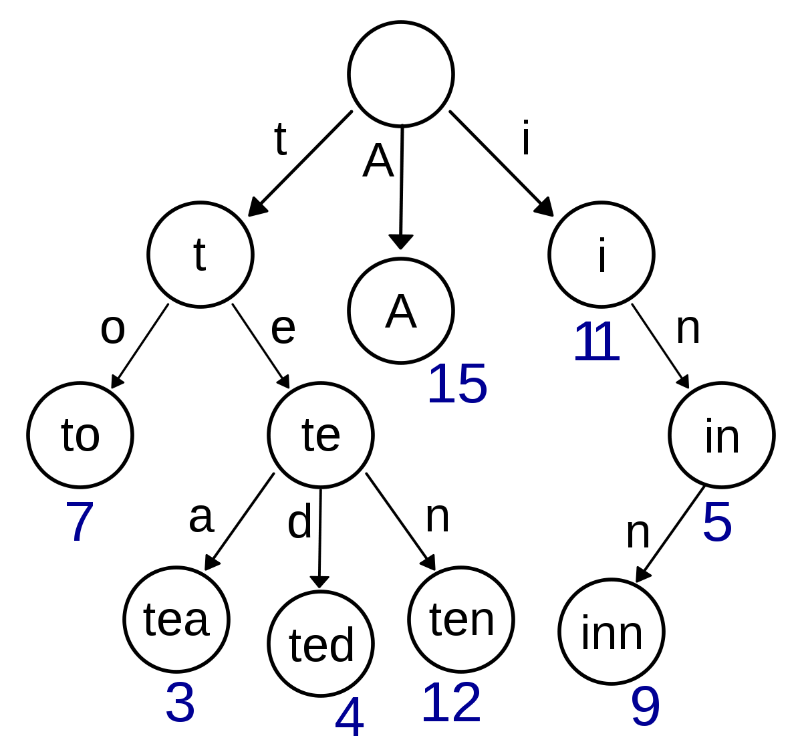

# It's a Tree... It's a Graph... It's a Traph!

  
    Designing an on-file multi-level graph index for the Hyphe web crawler
  

 

  <small>
    Mathieu Jacomy • Paul Girard • Benjamin Ooghe-Tabanou • Guillaume Plique
  </small>

===

  

===

<h2>
  I. Hyphe
</h2>

===

TODO: demo hyphe, web entities, lrus

===

<h2>
  II. Before: Lucene
</h2>

===

TODO: limits

TODO: operations: pages by prefix, page's webentity, ability to dynamically change webentities. NOT queries + dynamic changes => recache index slow

SCHEMA: for NOT queries => illustrate using Wikipedia

TODO: plus various caveats

TODO: mea culpa

TODO: it works, but it's slow (indexation is slower than the web...)

===

<h2>
  III. A battle to the death
</h2>

TODO: vs. Lucene/Neo4J/Traph
* [Java Tree POC](https://github.com/medialab/hyphe-java-tree-poc)
* [Neo4J POC](https://github.com/medialab/hyphe-neo4j-poc)

===

<h2>
  IV. Prototype A - Neo4j
</h2>

* example schema LRUS/Wes stockées dans neo4J
* Complexité à écrire certaines requetes
 + WECreationRules -> [complex but OK](https://github.com/medialab/hyphe-neo4j-poc/blob/master/queries/core.cypher#L66-L164)
 + Query WELinks... [10 versions](https://github.com/medialab/hyphe-neo4j-poc/blob/master/queries/core.cypher#L183-L289), même Procédures stockées
  => #fail

===

TODO: we have a graph, let's use Neo4j

TODO: UNWIND big win

TODO: mettre une grosse requete qui tache

SCHEMA: benj schema neo4j des lrus

===

<h2>
  V. Prototype B - The Traph
</h2>

===

  

===

# Designing our own on-file index

  To store a somewhat complicated multi-level graph of URLs

===

### Isn't that what crazy people do?

TODO: people told us not to do it!

* Building an on-file structure from scratch is not easy.
* Why would you do that instead of relying on some already existing solution?
* What if it crashes?
* What if your server unexpectedly shuts down?
* What if humanity ceases to exist?

\[\[ Insert a lot of other perfectly reasonable concerns \]\]

===

### Not so crazy

* You cannot get faster than a tailored data structure (that's a fact).
* We don't need deletions (huge win!).
* No need for an **ACID** database (totally overkill).

===

### We just need an index

* An index does not store any "original" data because...
* ...a MongoDB stores the data in a reliable way.
* \[ insert joke about MongoDB being bad \]
* This means the index can be completely recomputed and its utter destruction does not mean we can lose data.

===

# So let's build this index!

===

# We'll call it the Traph!

===

# But, seriously, what is a Traph?

===

The traph is a "subtle" mix between a <u>Trie</u> and a <u>Graph</u>.

<small>Hence the incredibly innovative name...</small>

===

## A Trie

The **Trie** is a prefix tree.

  

===

TODO: a trie of lrus - blocks

===

## A Graph

How do we make this a graph

TODO: graph of pages. link store - linked lists of stubs

===

the multi-level graph

TODO: flagging the trie for webentities - DFS and bubbling up

===

Benchmark: some [astonishing numbers](https://github.com/medialab/hyphe-neo4j-poc/blob/master/benchmark.md)

===

Implémentation python

TODO: trie organized with children as linked lists

TODO: stems - issue - ternary search tree - balancing

TODO: compare bench again (see my notes for size & speed)

===

## Takeaway bonus: varchars(255)

Sacrificing one byte to have the string's length will always be faster than manually dropping null bytes.

===

<!-- .slide: data-background="img/varchars.png" -->

===

**Huge win!** - 2x boost in performance.

===

TODO: we used lucene badly but still + stored procedures in Neo4j

===

  Here we are now.

 

  

 

  The web is the bottleneck again!

===

Current version of [Hyphe](https://github.com/medialab/hyphe) runs this index.

===

# But...

===

We are confident we can further improve our structure and that people here can help us do so!

===

  Thanks for your attention.

