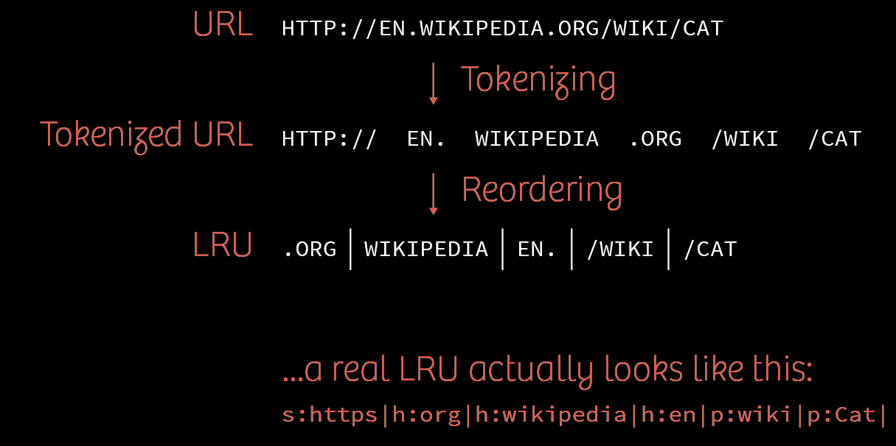
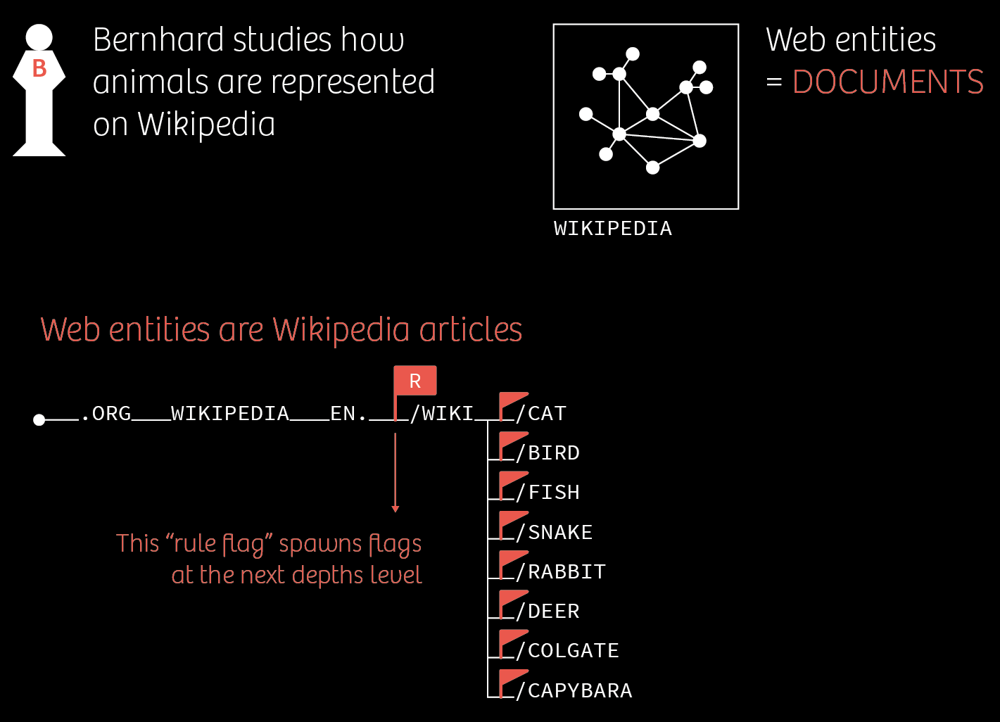
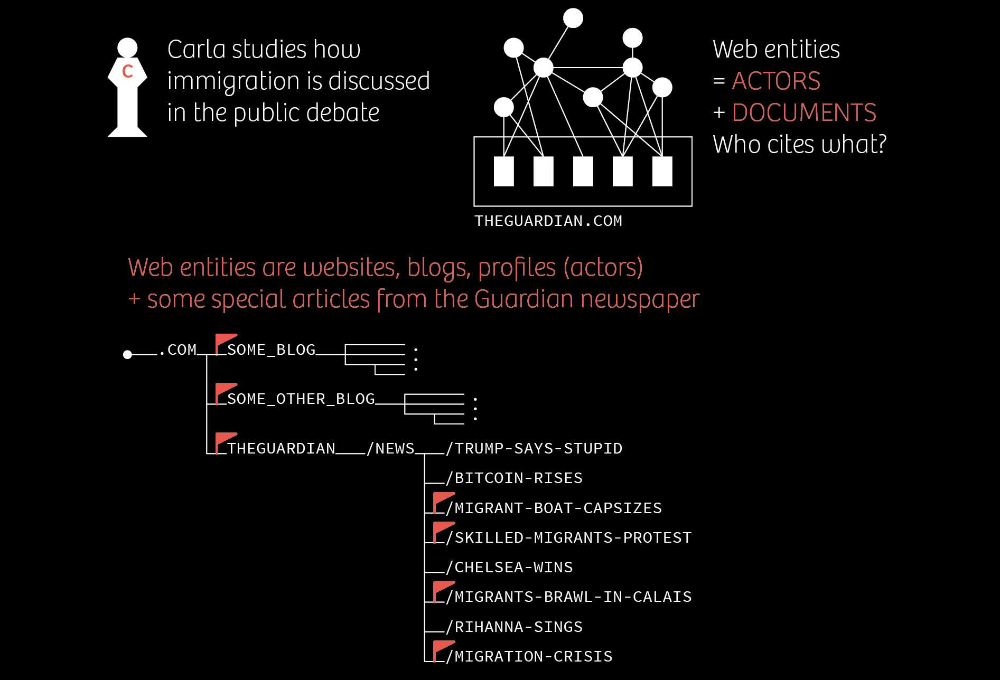
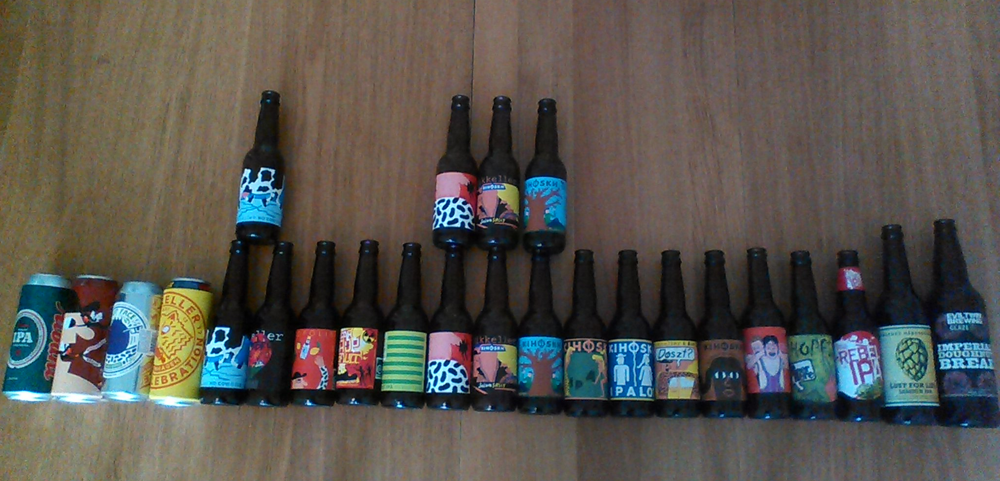

# It's a Tree... It's a Graph...  
# It's a Traph!!!!

<center>
  <span class="red-title">
    Designing an on-file<br>
    multi-level graph index<br>
    for the Hyphe web crawler
  </span>
</center>

<br>

<center>
  <small>
    Paul Girard • Mathieu Jacomy • Benjamin Ooghe-Tabanou • Guillaume Plique
  </small>
</center>

===

<center>
  
</center>

<center>
  <small>
    Equipex DIME-SHS ANR-10-EQPX-19-01
  </small>
</center>

<center>
  
</center>

===

# Hyphe?
* A web corpus curation tool
* A research-driven web crawler
* Demo: http://hyphe.medialab.sciences-po.fr/demo/
* v1.0 finally easily installable via Docker

===



===


===


===


===



===



===

## A tree of URLs and a graph of links


===

## Structure's requirements

* Add tens of millions of LRUs
* Add hundreds of millions of links
* Edit web entity boundaries (move the flags) without re-indexing
* Get all the pages of a web entity
* Get the web entity graph sitting on top of the pages' one

===

# It's a tree

===

# It's a graph

===

# How to implement that?

===

<h2>
  <span class="red-number">I.</span><br> Lucene
</h2>

===

## A tree?

- index of pages
- filter by prefix

===

## A graph?

- index of pages couples
- agregate links by couples of prefixes

===

## Problem

- Links between web entities are agregates
- web entities are dynamic

-> WE links should be computed, not stored

===

## Remember Bernhard?


===

## Limits

- Agregate links for list of prefixes
- but NOT for sub-prefixes!

-> complex slow queries

===

## Turnarounds

* Pages/WebEntities links caching in Lucene
* WebEntitites links caching in RAM

===

## User issue

TODO: Screenshot network Hyphe

===

# indexation is slower than crawling...

===

<h2>
  <span class="red-number">II.</span><br>Coding retreat
</h2>

===

- One week
- Four brains
- TANT LAB @Copenhaguen
- 2 prototypes
  * [Java Tree POC](https://github.com/medialab/hyphe-java-tree-poc)
  * [Neo4J POC](https://github.com/medialab/hyphe-neo4j-poc)

===

<center>
  
</center>  

===

<center>
  
</center>  

===

<center>
  
</center>  

===

<h2>
  <span class="red-number">III.</span><br>Prototype A - Neo4J
</h2>

===

## A tree? A graph?

<center>
  
</center>  

===

## Challenge: complex querying

- `UNWIND`
- `FOREACH`
- `REDUCE`
- `CASE`
- stored procedures...

===

[Indexing pages](https://github.com/medialab/hyphe-neo4j-poc/blob/master/queries/core.cypher#L66-L164)

```cypher
UNWIND $lrus AS stems
WITH [{lru: ""}] + stems AS stems
WITH stems[size(stems)-1].lru as lru, extract(n IN range(1, size(stems) - 1) | {first: stems[n - 1], second: stems[n]}) AS tuples
UNWIND tuples AS tuple

FOREACH (_ IN CASE WHEN NOT coalesce(tuple.second.page, false) THEN [1] ELSE [] END |
  MERGE (a:Stem {lru: tuple.first.lru})
  MERGE (b:Stem {lru: tuple.second.lru})
    ON CREATE SET
      b.type = tuple.second.type,
      b.stem = tuple.second.stem,
      b.createdTimestamp = timestamp()
  MERGE (a)<-[:PARENT]-(b)
)

FOREACH (_ IN CASE WHEN coalesce(tuple.second.page, false) THEN [1] ELSE [] END |
  MERGE (a:Stem {lru: tuple.first.lru})
  MERGE (b:Stem {lru: tuple.second.lru})
    ON CREATE SET
      b.type = tuple.second.type,
      b.stem = tuple.second.stem,
      b.crawlDepth = tuple.second.crawlDepth,
      b.linked = coalesce(tuple.second.linked, false),
      b:Page
    ON MATCH SET
      b.crawlDepth =
        CASE
          WHEN tuple.second.crawlDepth < b.crawlDepth
          THEN tuple.second.crawlDepth
          ELSE b.crawlDepth
          END,
      b.linked = coalesce(tuple.second.linked, b.linked),
      b:Page
  MERGE (a)<-[:PARENT]-(b)
);
```

===

Links agregation [V1 (out of 10)](https://github.com/medialab/hyphe-neo4j-poc/blob/master/queries/core.cypher#L183-L289)

```cypher
MATCH p=(weSource:WebEntity)<-[:PREFIX]-(:Stem)<-[:PARENT*0..]-(sourcePage:Page)
WITH sourcePage, reduce(we = null , path in collect({length:length(p), we:weSource}) |
  CASE WHEN we IS NULL OR we.length>=path.length THEN path ELSE we END).we as weSource
MATCH (sourcePage)-[:LINK]->(targetPage:Page)
WITH weSource,sourcePage,targetPage, count(*) as weight
MATCH p=(targetPage)-[:PARENT*0..]->(:Stem)-[:PREFIX]->(we:WebEntity)
WITH weSource,targetPage,reduce(we = null , path in collect({length:length(p), we:we}) |
  CASE WHEN we IS NULL OR we.length>=path.length THEN path ELSE we END).we as weTarget, weight
RETURN weSource.name as Source,weTarget.name as Target, sum(weight) as Weight
```

===

We even tried stored procedure to traverse the tree easily.

===

<h2>
  <span class="red-number">IV.</span><br>Prototype B - The Traph
</h2>

===

## Designing our own on-file index

<p class="red">
  To store a somewhat complicated multi-level graph of URLs
</p>

===

## People told us NOT to do it

===

### It certainly seems crazy...

* Building an on-file structure from scratch is not easy.
* Why would you do that instead of relying on some already existing solution?
* What if it crashes?
* What if your server unexpectedly shuts down?

===

### Not so crazy

* You cannot get faster than a tailored data structure (that's a fact).
* We don't need deletions (huge win!).
* No need for an **ACID** database (totally overkill).

===

### We just need an index

* An index does not store any "original" data because...
* ...a MongoDB already stores the actual data in a reliable way.
* \[ insert joke about MongoDB being bad \]
* This means the index can be completely recomputed and its utter destruction does not mean we can lose information.

===

# So, what's a Traph?

===

<center>
  
</center>  

===

The traph is a "subtle" mix between a <u>Trie</u> and a <u>Graph</u>.

<small>Hence the incredibly innovative name...</small>

===

## A Trie of LRUs


===

## Storing a Trie on file

Using fixed-size blocks of binary data (ex: 10 bytes).

We can read specific ones using pointers in a random access fashion.

Accessing a specific's page node is done in `O(m)`.

---

```very-large
[char|flags|next|child|parent|outlinks|inlinks]
```

===

## A Graph of pages

The second part of the structure is a distinct file storing links between pages.

We need to store both out links and in links.

```cypher
(A)->(B)

(A)<-(B)
```

===

## Storing links on file

Once again: using fixed-sized blocks of binary data.

We'll use those blocks to represent a bunch of linked list of stubs.

---

```very-large
[target|weight|next]
```

===

### Linked lists of stubs

```large
{LRUTriePointer} => [targetA, weight] -> [targetB, weight] -> ø
```

===

We can now store our links.

We have a graph of pages!

===

## What about the multi-level graph?

What we want is the graph of **webentities** sitting above the graph of pages.

We "just" need to flag our Trie's nodes for webentities' starting points.

===


===

So now, finding the web entity to which belongs a page is obvious when traversing the Trie.

What's more, we can bubble up in `O(m)`, if we need to, when following pages' links (this can also be easily cached).

===


===

What's more, if we want to compute the webentities' graph, one just needs to perform a DFS on the Trie.

This seems costly but:

* No other way since we need to scan the whole index at least once.
* The datastructure is quite lean and you won't read so much.

===

## Was it worth it?

Benchmark on a 10% sample from a sizeable corpus about privacy.

* Number of pages: **1 840 377**
* Number of links: **5 395 253**
* Number of webentities: **20 003**
* Number of webentities' links: **30 490**

===

## Indexation time

* **Lucene** • 1 hour & 55 minutes
* **Neo4j** • 1 hour & 4 minutes
* **Traph** • 20 minutes

===

## Graph processing time

* **Lucene** • 45 minutes
* **Neo4j** • 6 minutes
* **Traph** • 2 minutes 35 seconds

===

## Disk space

* **Lucene** • 740 megabytes
* **Neo4j** • 1.5 gigabytes
* **Traph** • 1 gigabytes

Note: it seems that Lucene wins. Not for long.

===

## After Copenhagen

We decided to redevelop the structure in **python** to limit the amount of different languages used by Hyphe's core.

We made some new discoveries on the way.

===

## Bonus section

* Single character trie is slow: stem level is better
* We had to find a way to store variable length stems
* Results were bad at beginning because of linked lists
* We had to organize children as binary search trees: this is a ternary search tree
* We tried to use auto-balancing BSTs but this was useless since crawl order generate enough entropy
* Finally we switched to using varchars(255) rather than trimming null bytes to double performance.

(Related slides are vertical)

----

## The issue with single characters

Our initial implementation was using single LRU characters as nodes.

Wastes a lot of spaces: more nodes = more pointers, flags etc.

More disk space = longer queries because we need to read more data from the disk.

We can do better: nodes should store LRU **stems**!

----


----


----

## Fragmented nodes

**Problem**: stems can have variable length.

Fixed-size binary blocks => we need to be able to fragment them.

---

```large
[stem|flags|next|parent|outlinks|inlinks] ... [tail?]
        ^
     has_tail?
```

----

## Results were disappointing...

* **Character level** • 5 400 000 reads / 1 001 000 total blocks
* **Stem level** • 12 750 000 reads / 56 730 total blocks

Stem level had far less blocks and was orders of magnitudes lighter.

Strangely, it was way slower because we had to read a lot more.

----

## Linked lists hell

Node's children stored as linked lists.

This means accessing a particular child is `O(n)`.

At character level, a list cannot be larger than `255` since we store a single ascii byte.

At stem level, those same linked lists will store a lot more children.

----

## The Ternary Search Tree

We had to organize children differently.

We therefore implemented a <u>Ternary Search Tree</u>.

This is a Trie whose children are stored as binary search trees so we can access children in `O(log n)`.

----

<center>
  
</center>

----

## Indexation time

* **Python character level traph** • 20 minutes
* **Python stem level traph** • 8 minutes

----

## Graph processing time

* **Python character level traph** • 2 minutes 43 seconds
* **Python stem level traph** • 27 seconds

----

## Disk space

* **Python character level traph** • 827 megabytes
* **Python stem level traph** • 270 megabytes

----

## About balancing

Binary search trees can degrade to linked lists if unbalanced.

We tried several balanced BSTs implementations: treap & red-black.

This slowed down writes and did nothing to reads.

It seems that the order in which the crawled pages are fed to the structure generate sufficient entropy.

----

## Takeaway bonus: varchars(255)

Sacrificing one byte to have the string's length will always be faster than manually dropping null bytes.

----

<!-- .slide: data-background="img/varchars.png" -->

----

**Huge win!** - 2x boost in performance.

----

## A final mea culpa

Yes we probably used Lucene badly.

Yes we probably used Neo4j badly.

But. If you need to twist that much a system - by tweaking internals and/or using stored procedures - aren't you in fact developing something else?

===

<center>
  Here we are now.
</center>

<br>

<center>
  
</center>

<br>

<center>
  The web is the bottleneck again!
</center>

===

The current version of [Hyphe](https://github.com/medialab/hyphe) uses this index in production!

===

## But...

We are confident we can further improve the structure.

And that people in this very room can help us do so!

===

<center>
  Thanks for your attention.
</center>
