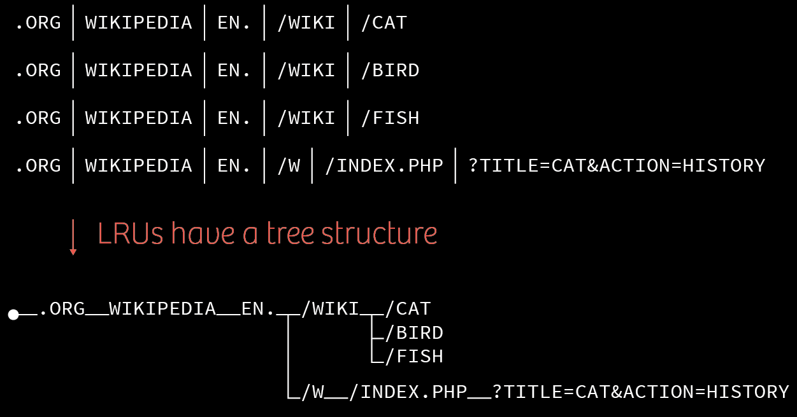
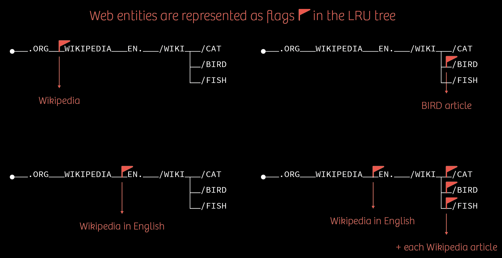
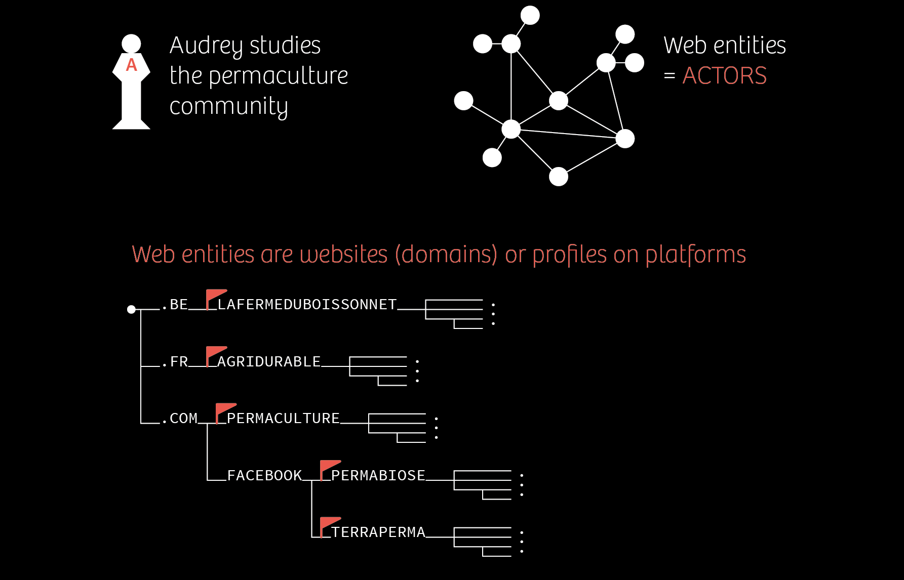

# It's a Tree... It's a Graph...  
# It's a Traph!!!!

<center>
  <span class="red-title">
    Designing an on-file    
    multi-level graph index  
    for the Hyphe web crawler
  </span>
</center>

<br>

<center>
  <small>
    Mathieu Jacomy • Paul Girard • Benjamin Ooghe-Tabanou • Guillaume Plique
  </small>
</center>

===
<center><small>Produced by</small></center>
<center>
  
</center>  
  
  

===

<h2>
  <span class="red-number">I.</span><br>Hyphe
</h2>

===


===



===



===



===


===


===

TODO: demo hyphe, web entities, lrus

===

So we have a trie of LRU
and a network of links

===

=> traph

===

<h2>
  <span class="red-number">II.</span><br>Before there was Lucene
</h2>

===

TODO: limits

TODO: operations: pages by prefix, page's webentity, ability to dynamically change webentities. NOT queries + dynamic changes => recache index slow

SCHEMA: for NOT queries => illustrate using Wikipedia

TODO: plus various caveats

TODO: mea culpa

=== 
To sum up: indexation is slower than the web...

===

<h2>
  <span class="red-number">III.</span><br>Coding retreat
</h2>
===
One week
Four brains
TANT LAB @Copenhaguen
2 prototypes
===


===
TODO: vs. Lucene/Neo4J/Traph
* [Java Tree POC](https://github.com/medialab/hyphe-java-tree-poc)
* [Neo4J POC](https://github.com/medialab/hyphe-neo4j-poc)

===

<h2>
  <span class="red-number">IV.</span><br>Prototype A - Neo4j
</h2>

* example schema LRUS/Wes stockées dans neo4J
* Complexité à écrire certaines requetes
 + WECreationRules -> [complex but OK](https://github.com/medialab/hyphe-neo4j-poc/blob/master/queries/core.cypher#L66-L164)
 + Query WELinks... [10 versions](https://github.com/medialab/hyphe-neo4j-poc/blob/master/queries/core.cypher#L183-L289), même Procédures stockées
  => #fail

===

TODO: we have a graph, let's use Neo4j

TODO: UNWIND big win

TODO: mettre une grosse requete qui tache

SCHEMA: benj schema neo4j des lrus

===

<h2>
  <span class="red-number">V.</span><br>Prototype B - The Traph
</h2>

===

<center>
  
</center>

===

# Designing our own on-file index

<center class="red">
  To store a somewhat complicated multi-level graph of URLs
</center>

===

## People told us NOT to do it

===

### It certainly seems crazy...

* Building an on-file structure from scratch is not easy.
* Why would you do that instead of relying on some already existing solution?
* What if it crashes?
* What if your server unexpectedly shuts down?
* What if a thermonuclear war eradicates mankind?

\[\[ Insert a lot of other perfectly reasonable concerns \]\]

===

### Not so crazy

* You cannot get faster than a tailored data structure (that's a fact).
* We don't need deletions (huge win!).
* No need for an **ACID** database (totally overkill).

===

### We just need an index

* An index does not store any "original" data because...
* ...a MongoDB already stores the actual data in a reliable way.
* \[ insert joke about MongoDB being bad \]
* This means the index can be completely recomputed and its utter destruction does not mean we can lose information.

===

# So let's build this index!

===

# We'll call it the Traph!

===

# But, seriously, what is a Traph?

===

The traph is a "subtle" mix between a <u>Trie</u> and a <u>Graph</u>.

<small>Hence the incredibly innovative name...</small>

===

## A Trie of LRUs

SCHEMA: schema of character level lrus.

===

## Storing a Trie on file

Using fixed-size blocks of binary data (ex: 10 bytes).

We can read specific ones using pointers in a random access fashion.

===

SCHEMA: schema of binary lru trie block.

===

SCHEMA: schema of the Trie with blocks.

===

We can now insert & query pages in `O(m)`.

===

## A Graph of pages

The second part of the structure is a distinct file storing links between pages.

We need to store both out links and in links.

```cypher
(A)->(B)

(A)<-(B)
```

===

## Storing links on file

Once again: using fixed-sized blocks of binary data.

We'll use those blocks to represent a bunch of linked list of stubs.

===

SCHEMA: schema of binary lru store block

===

### Linked lists of stubs

```large
{LRUTriePointer} => [targetA, weight] -> [targetB, weight] -> ø
```

===

We can now store our links.

We have a graph of pages!

===

## What about the multi-level graph?

What we want is the graph of **webentities** sitting above the graph of pages.

===

We "just" need to flag our Trie's nodes for webentities' starting points.

SCHEMA: trie with webentities boundaries' & flag

===

So now, finding the webentity to which belongs a page is obvious when traversing the Trie.

What's more, we can bubble up in `O(m)`, if we need to, when following pages' links (this can also be easily cached).

===

REUSE EARLIER SCHEMA

===

What's more, if we want to compute the webentities' graph, one just needs to perform a DFS on the Trie.

This seems costly but:

* No other way since we need to scan the whole index at least once.
* The datastructure is quite lean and you won't read so much.

===

## But was it worth it?

===

## Our benchmark

10% sample of a sizeable corpus about privacy.

* Number of pages: **1 840 377**
* Number of links: **5 395 253**
* Number of webentities: **20 003**
* Number of webentities' links: **30 490**

===

## Indexation time

* **Lucene** • 1 hour & 55 minutes
* **Neo4j** • 1 hour & 4 minutes
* **Traph** • 20 minutes

===

## Graph processing time

* **Lucene** • 45 minutes
* **Neo4j** • 6 minutes
* **Traph** • 2 minutes 35 seconds

===

## Disk space

* **Lucene** • 740 megabytes
* **Neo4j** • 1.5 gigabytes
* **Traph** • 1 gigabytes

===

OK.

Lucene seems to win the disk space battle.

===

Not for long.

===

## After Copenhagen

We decided to redevelop the structure in **python** to limit the amount of different languages used by Hyphe's core.

We made some new discoveries on the way.

===

## Beyond characters

Our initial implementation was using single LRU characters as nodes.

This means we waste a lot of space due to the multiplication of needed nodes: more pointers, more flags etc.

More disk space also means that graph queries are longer because of the amount of data we need to read from the disk.

We could do better: nodes should store LRU **stems**!

===

SCHEMA: the character level LRU Trie once again

===

SCHEMA: the stem level LRU Trie

===

## Fragmented nodes

Problem: stems can have variable length.

But we have fixed-size binary blocks.

We need to somehow fragment them.

===

SCHEMA: reuse block with additional pointer to the tail

===

## Results were disappointing...

* **Character level** • 5 400 000 reads / 1 001 000 total blocks
* **Stem level** • 12 750 000 reads / 56 730 total blocks

Stem level had far less blocks and was orders of magnitudes lighter.

But strangely, it was way slower because we had to read a lot more.

===

## Linked lists hell

A Trie node's children where so far stored as linked lists.

This means access to a particular child is `O(n)`.

But, at character level, a list cannot be larger than `255` since we store a single ascii bytes.

At stem level, those same linked lists can actually store a lot more children.

===

We had to organize children differently.

We therefore implemented a <u>Ternary Search Tree</u>

===

## The Ternary Search Tree

A Trie whose children are stored as binary search trees.

This means we can access the desired child in `O(log n)`.

===

SCHEMA: ternary search tree

===

## And finally results were good

===

## Indexation time

* **Python character level traph** • 20 minutes
* **Python stem level traph** • 8 minutes

===

## Graph processing time

* **Python character level traph** • 2 minutes 43 seconds
* **Python stem level traph** • 27 seconds

===

## Disk space

* **Python character level traph** • 827 megabytes
* **Python stem level traph** • 270 megabytes

===

## About balancing

Binary search trees can degrade to `O(n)` access - same as the linked list - if unbalanced.

We tried several balanced BSTs implementations (treap, red-black).

This slowed down writes and did nothing to reads.

It seems that the order in which the crawled pages are fed to the structure generate sufficient entropy.

===

## Takeaway bonus: varchars(255)

Sacrificing one byte to have the string's length will always be faster than manually dropping null bytes.

===

<!-- .slide: data-background="img/varchars.png" -->

===

**Huge win!** - 2x boost in performance.

===

## A final mea culpa

Yes we probably used Lucene badly.

Yes we probably used Neo4j badly.

But. If you need to twist that much a system - by tweaking internals and/or using store procedures - aren't you in fact developing something else?

===

<center>
  Here we are now.
</center>

<br>

<center>
  
</center>

<br>

<center>
  The web is the bottleneck again!
</center>

===

The current version of [Hyphe](https://github.com/medialab/hyphe) uses this index!

===

# But...

===

We are confident we can further improve the structure.

And that people here can help us do so!

===

<center>
  Thanks for your attention.
</center>
